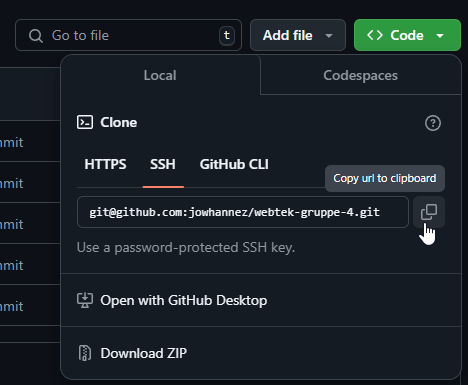

# Vårt første repository!

## Velkommen om bord folkens!

Dette klarer vi fint skal dere se :)

## Hvordan få koden på min maskin?

1. [Last ned git på din maskin](https://git-scm.com/downloads).
2. Kopier lenken for å klone ned repositoriet
   
3. Åpne terminalen din og naviger til en passende mappe.
4. Skriv inn følgende og trykk enter:

```git clone git@github.com:jowhannez/webtek-gruppe-4.git```

5. Voila, du har prosjektet lokalt og er klar til å starte utvikling!

Skriv likesågodt ```code .``` for å åpne prosjektet i VSCode med en gang. 